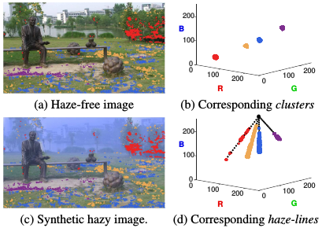
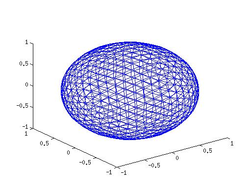
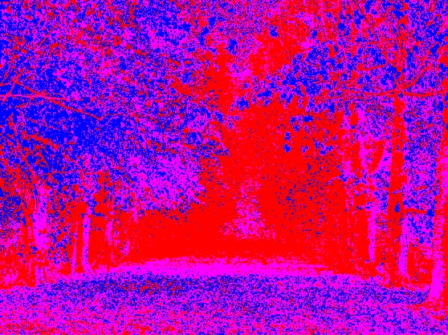
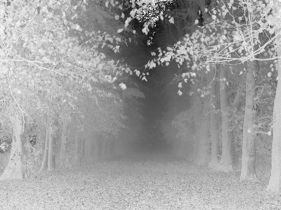
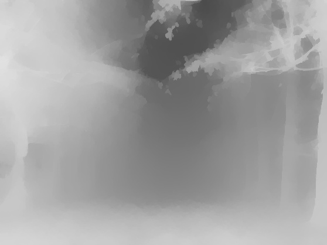

本文选自CVPR 2016, 文章链接[Dana Berman, Tali Treibitz, Shai Avidan. Non-Local Image Dehazing](http://cn.bing.com/academic/profile?id=bff305ca560573f5e52c13cce64f6e80&encoded=0&v=paper_preview&mkt=zh-cn)\
复现源码见我的[Github](https://github.com/xianshunw/scindapsus/tree/master/berman2016non-local)，原始的blog写在了cnblog上，但是由于cnblog维护的原因，blog已经不可见，最近又有同学问起这个问题，所以在这里搬运以下。

## **无雾图像和有雾图像的RGB空间表示**
一幅没有雾霾的图像可以用几百个不同的颜色很好的近似。将没有雾霾的图像每一个像素值表示为RGB空间的一个点，一幅图像的所有像素在RGB空间中的位置会发生如下图(b)所示的聚类现象：

$\mathbf{\mathit{I}}(x) = t(x)\mathbf{\mathit{J}}(x) + [1 - t(x)]\mathbf{\mathit{A}}(x)$(1)

每一个聚类包含的像素点分布在整副图像区域内，他们具有相近的RGB值，但是距离摄像机的距离远近不同。根据雾霾模型的公式，由于在同一聚类里的像素点分布在远近不同的位置所以同一聚类里不同的像素点 $t$ 取不同值（ $t$ 是一个只和景物据摄像机距离有关的量），因此无雾霾图像的聚类在有雾霾图像中被拉申成直线，称为雾霾线。直线的一端坐标值为无雾霾图像的聚类点的坐标，另一端为环境光 $\mathbf{\mathit{A}}$ 。对于雾霾图像中的所有聚类点，其对应雾霾线相交与一点，该点坐标即为环境光 $\mathbf{\mathit{A}}$ 。

<div align="center">

</div>

## **雾霾去除算法**
### **检测雾霾线**
在本实验中，选取[Single image haze removal using dark channel prior](http://cn.bing.com/academic/profile?id=00c685d62fb1b326466854c7302cfa20&encoded=0&v=paper_preview&mkt=zh-cn)的环境光估计算法，对于一幅雾霾图像计算其暗通道，然后取暗通道值前0.1%的像素点中最亮的像素值作为环境光的估计。\
然后定义$\mathbf{\mathit{I}}_{A}$如下：

$\mathbf{\mathit{I}}_{A}(x) = \mathbf{\mathit{I}}(x) - \mathbf{\mathit{A}} = t(x)[\mathbf{\mathit{J}}(x) - \mathbf{\mathit{A}}]$(2)

上面的公式将图像在RGB空间中的像素坐标进行了平移变换，环境光的坐标被变换到了原点。将$\mathbf{\mathit{I}}_{A}$表示成球坐标的形式：

$\mathbf{\mathit{I}}_{A}(x) = [r(x),\theta(x),\phi(x)]$(3)

这样雾霾图像的像素坐标就被表示成为球坐标空间中围绕着环境光（坐标原点）分布的坐标点。我们来观察(2)式，对于具有相同$\mathbf{\mathit{J}}$和$\mathbf{\mathit{A}}$的景物点，其离摄像机的距离只影响 $t$ 的取值，并且在球坐标系中改变 $t$ 只影响 $r$ 。因此对于无雾霾图像中的每一个聚类点，其对应的雾霾线在上述变换以后的球坐标系中都具有相同的$\theta,\phi$值。也就是说，具有相同的$\theta,\phi$值的像素点其对应的无雾霾图像的像素具有近似的值。为了确定哪些像素具有相同的$\theta,\phi$值，需要将图像根据$\theta,\phi$进行聚类。为此要先要对球面进行等距离剖分，需要注意的是等分$[0,2\pi]\times[0,\pi]$是无法得到均匀剖分的点的，你可以看一下地球仪的经纬剖分结果是否是这样。理论上说如果想要在一个球面上得到20个以上等距离剖分的点是不可能的，原因按住不表，有兴趣的可以搜索伯努利多面体。但是可以通过迭代细分正二十面体的方法来近似得到等距离剖分，具体步骤见[Colorado State University General Circulation Model](http://kiwi.atmos.colostate.edu/rr/groupPIX/ross/ross1/ross1.html)。下面给出C++实现剖分的方法：
```C++
void subdivide(icosahedron& src, polyhedron& dst, int num)
{
    dst = src.i; double r = src.radius;
	
    while(dst.vertex_table.size() < num)
    {
        std::map<std::vector<int>, int> mid_table;
        const int size = dst.plane_table.size();
        for(int i = 0; i != size; ++i)
        {
            auto f = *(dst.plane_table.begin());
            dst.plane_table.pop_front();
            int mid_idx12, mid_idx13, mid_idx23;

            if(!is_present(f[0], f[1], mid_table, mid_idx12))
            {
                cv::Point3d pt1 = dst.vertex_table[f[0]], pt2 = dst.vertex_table[f[1]];
                dst.vertex_table.emplace_back((pt1.x + pt2.x)/2, (pt1.y + pt2.y)/2, (pt1.z + pt2.z)/2);
                mid_idx12 = static_cast<int>(dst.vertex_table.size()) - 1;
                scale2unit(dst.vertex_table[mid_idx12], r);
                std::vector<int> temp = { f[0], f[1] };
                mid_table[temp] = mid_idx12;
            }

            if(!is_present(f[0], f[2], mid_table, mid_idx13))
            {
                cv::Point3d pt1 = dst.vertex_table[f[0]], pt2 = dst.vertex_table[f[2]];
                dst.vertex_table.emplace_back((pt1.x + pt2.x)/2, (pt1.y + pt2.y)/2, (pt1.z + pt2.z)/2);
                mid_idx13 = static_cast<int>(dst.vertex_table.size()) - 1;
                scale2unit(dst.vertex_table[mid_idx13], r);
                std::vector<int> temp = { f[0], f[2] };
                mid_table[temp] = mid_idx13;
            }

            if(!is_present(f[1], f[2], mid_table, mid_idx23))
            {
                cv::Point3d pt1 = dst.vertex_table[f[1]], pt2 = dst.vertex_table[f[2]];
                dst.vertex_table.emplace_back((pt1.x + pt2.x)/2, (pt1.y + pt2.y)/2, (pt1.z + pt2.z)/2);
                mid_idx23 = static_cast<int>(dst.vertex_table.size()) - 1;
                scale2unit(dst.vertex_table[mid_idx23], r);
                std::vector<int> temp = { f[1], f[2] };
                mid_table[temp] = mid_idx23;
            }
			
            std::vector<int> t = { f[0], mid_idx12, mid_idx13 };
            dst.plane_table.push_back(t);
            t[0] = mid_idx23;
            dst.plane_table.push_back(t);
            t[2] = f[1];
            dst.plane_table.push_back(t);
            t[1] = mid_idx13; t[2] = f[2];
            dst.plane_table.push_back(t);
        }
    }
}

```
为了验证剖分的正确性，将剖分结果用MATLAB绘制出来，如下：

<div align="center">

</div>

为了实现快速的查找，对还需对剖分以后的点集建立KD树（因为我们只在乎每一个像素点的$\theta,\phi$值，且剖分后的点都在球面上具有相同的 $r$ ，所以只需要对剖分后的点的$(\theta,\phi)$坐标建立KD树)。下面是建树的C++实现:
```C++
kd_node* build_kdTree(std::vector<cv::Point2d>& sph_table, kd_node* p, std::vector<int>& subset)
{
    kd_node* r = new kd_node; r->parent = p;
    if(subset.size() == 1)
    {
        r->data = subset[0];
        r->dimension = 0;
        r->left = r->right = nullptr;
        r->is_leaf = true;
        return r;
    }

    std::vector<std::vector<int>> subsets;
    r->dimension = dimension_choice(sph_table, subset);
    r->data = split(sph_table, subset, subsets, r->dimension);
    r->is_leaf = false;

    r->left = subsets[0].size() != 0 ? build_kdTree(sph_table, r, subsets[0]) : nullptr;
    r->right = subsets[1].size() != 0 ? build_kdTree(sph_table, r, subsets[1]) : nullptr;

    return r;
}
```

为了验证聚类结果， 将聚类结果用不同的颜色显示如下(因为一共使用了三种颜色，聚类的数目远大于3，所以同一种颜色并不一定是同一个聚类)：

<div align="center">

</div>

其对应的原图如下：

<div align="center">

</div>

### **传输系数初始值的估计**
对于一条给定的雾霾线，里面的所有像素具有近似相等的$J$和$A$的值, $r(x)$有下式决定：

$r(x) = t(x)\left \| J - A \right \|$(4)

当$t = 1$对应最大的径向坐标：

$r_{max} = \left \| J - A \right \|$(5)

联合(4)(5)得：

$t(x) = r(x)/r_{max}$(6)

对于每一条聚类线，由下式估计 $ r_{max} $:

$\hat{r}_{max} = \max_{x\in H}[r(x)]$(7)

其中$H$表示每一条雾霾线。所以每一个像素点可以估计出对应的传输系数为：

$\tilde{t}(x) = r/\hat{r}_{max}$(8)

本文估计的传输系数如下：

<div align="center">

</div>

### **传输系数正则化**
由于$J$始终取正值，所以根据(1)式可以给出传输系数的下界:
$t_{LB}(x) = 1 - \min_{c \in {R,G,B}}{I_{c}(x)/A_{c}}$ (9)

所以对传输系数进行下界约定后有：

$\tilde{t}_{LB}(x) = \max[\tilde{t}(x),t_{LB}(x)]$(10)

除此之外，上面对传输系数的估计只是基于雾霾线的假设。可以预见的是一个聚类里面的像素点数目越少，上面的假设的可信度越小。还有，传输系数的估计还要考虑道原始像素的空间相似性，我们有理由相信领域内像素值越接近的两个像素点其对应的传输系数也越接近。所以为了权衡上面的两个条件，最终的传输系数有下面的最小化问题给出：

$\sum_{x}\frac{[\tilde{t}(x) - \tilde{t}_{LB}(x)]^2}{\delta^2(x)} + \lambda\sum_{x}\sum_{y\in N_{x}}\frac{[\tilde{t}(x) - \tilde{t}(y)]^2}{\left \| I(x) - I(y) \right \|^2}$(11)

其中$\lambda$的作用是用来权衡两个假设之间的关系，这里面取0.1。$N_{x}$表示 $x$ 像素的四领域。$\delta(x)$是每一条雾霾线得到的传输系数估计值的标准差。原文中指出$\delta(x)$扮演着一个重要角色，因为如果一个聚类里面的点数分布随着$\delta(x)$变大而减小，这里说的是像素点的分布情况而不是点数。
这个最优化问题的解法很简单，因为是一个很简单的凸函数，很容易通过求导为零来解，实际上就是求解下面一个线性方程组：

$(\frac{2}{\delta^2_{i}} + 4\lambda \sum_{p}\frac{1}{\left \| I_{i} - I_{p} \right \|^2})\tilde{t}_{i} - 4\lambda\sum_{p}\frac{\tilde{t}_{p}}{\left \| I_{i} - I_{p} \right \|^2} = \frac{2}{\delta^2_{i}}\tilde{t}_{LBi}$(12)

本文利用的数值解法是GSL库提供的GMRES算法。正则化结果如下：

<div align="center">

</div>

### **去雾**
去雾步骤很简单，将上面估计出来的传输系数和环境光强度带入下面公式即可达到去雾的目的。

$\tilde{J} = (I(x) - [1 - \tilde{t}(x)]A)/\tilde{t}(x)$

注意的是，一定要防止数值的一出，如果单一通道的数值溢出很容易出现色斑。本人前面的工作已经在两个星期之前完成，但是由于没有检测道溢出的问题使这个工作一直道今天才完成
去雾结果如下，这个结果没有做论文中所说的对比度的拉伸，所以结果有些偏暗：

<div align="center">

</div>

这些工作是本人研一代陪用来打发时间的，有错误欢迎指正，谢谢！

